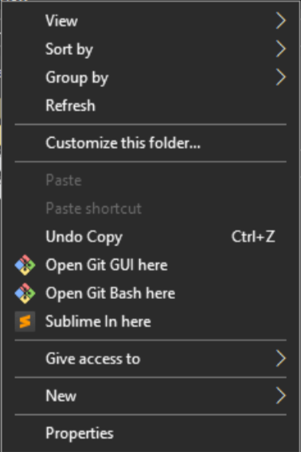

# Sublime In Here

Abre o **Sublime Text** diretamente na pasta clicada pelo menu do botão direito no Windows.



## Requisitos

Adicionar a pasta open-sublime para a desktop, ou alterar o caminho para abrir o script.

## Como modificar os caminhos no `.reg`

Se você mover a pasta ou usa um Python instalado em outro local, basta **editar o arquivo `.reg`** e modificar estas partes:

```reg
[HKEY_CLASSES_ROOT\*\shell\Sublime In here\command]
@="C:\\Users\\Administrator\\AppData\\Local\\Programs\\Python\\Python313\\pythonw.exe \"C:\\Users\\Administrator\\Desktop\\open-sublime\\openSublime.pyw\" \"%1\""
```

[caminho para o python] / [caminho para o arquivo.pyw]
